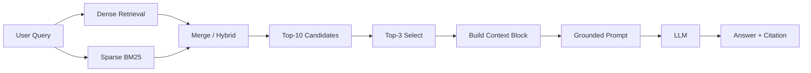

# Architecture — RAG Pipeline (Day 08 Lab)

## 1. Tổng quan kiến trúc

```
[5 PDF nội bộ: CS / IT / HR / Security]
    ↓
[index.py: PDF Reader → Preprocess → Section Chunking → Embedding → ChromaDB]
    ↓
[chroma_db / collection: rag_lab]
    ↓
[rag_answer.py: Query → Dense/Hybrid Retrieval → Top-k Select → Grounded Prompt]
    ↓
[Answer ngắn gọn + citation theo chunk]
```

**Mô tả ngắn gọn:**
Nhóm xây một trợ lý RAG nội bộ để trả lời câu hỏi về SLA sự cố, hoàn tiền, cấp quyền hệ thống, HR policy và IT helpdesk. Hệ thống ưu tiên trả lời có chứng cứ từ tài liệu đã index, thay vì để model trả lời tự do, nhằm giảm hallucination khi dùng cho ngữ cảnh vận hành nội bộ.

---

## 2. Indexing Pipeline (Sprint 1)

### Tài liệu được index
| File | Nguồn | Department | Số chunk |
|------|-------|-----------|---------|
| `policy_refund_v4.pdf` | `policy/refund-v4.pdf` | CS | 6 |
| `sla_p1_2026.pdf` | `support/sla-p1-2026.pdf` | IT | 5 |
| `access_control_sop.pdf` | `it/access-control-sop.md` | IT Security | 7 |
| `it_helpdesk_faq.pdf` | `support/helpdesk-faq.md` | IT | 6 |
| `hr_leave_policy.pdf` | `hr/leave-policy-2026.pdf` | HR | 5 |

**Tổng số chunk trong index:** `29`

### Quyết định chunking
| Tham số | Giá trị | Lý do |
|---------|---------|-------|
| Chunk size | `400` tokens (xấp xỉ `1600` ký tự) | Nằm trong khoảng slide gợi ý 300-500 tokens, đủ giữ trọn một điều khoản hoặc một cụm bullet liên quan |
| Overlap | `80` tokens (xấp xỉ `320` ký tự) | Giữ continuity giữa các chunk liền kề, giảm mất ngữ cảnh ở ranh giới đoạn |
| Chunking strategy | Heading-based trước, paragraph-based sau | `index.py` tách theo heading kiểu `=== Section ... ===`, rồi chỉ cắt tiếp theo paragraph/câu khi section quá dài |
| Metadata fields | `source`, `section`, `effective_date`, `department`, `access` | Phục vụ citation, debug retrieval, freshness và kiểm tra coverage metadata |

### Embedding model
- **Model**: `text-embedding-3-small`
- **Vector store**: ChromaDB `PersistentClient`, collection `rag_lab`
- **Similarity metric**: Cosine (`hnsw:space = cosine`)

---

## 3. Retrieval Pipeline (Sprint 2 + 3)

### Baseline (Sprint 2)
| Tham số | Giá trị |
|---------|---------|
| Strategy | Dense retrieval |
| Top-k search | `10` |
| Top-k select | `3` |
| Rerank | Không |

Baseline dùng `retrieve_dense()` để lấy top-10 candidates, sau đó cắt còn top-3 chunk đưa vào prompt. Cách này đơn giản, nhanh và đủ tốt với các câu hỏi factoid như SLA P1, refund window, remote policy.

### Variant (Sprint 3)
| Tham số | Giá trị | Thay đổi so với baseline |
|---------|---------|------------------------|
| Strategy | Hybrid retrieval (`dense + sparse/BM25`) | Đổi từ dense sang hybrid |
| Top-k search | `10` | Giữ nguyên |
| Top-k select | `3` | Giữ nguyên |
| Rerank | Không | Giữ nguyên để đảm bảo A/B chỉ đổi 1 biến |
| Query transform | Không dùng | Giữ nguyên |

**Lý do chọn variant này:**
Chọn hybrid vì corpus không chỉ có văn bản chính sách tự nhiên mà còn có alias, tên tài liệu cũ và keyword đặc thù như `Approval Matrix`, `P1`, `Level 3`, `ERR-403-AUTH`. Dense retrieval phù hợp với câu hỏi diễn đạt tự nhiên, còn sparse/BM25 bù lại cho exact keyword match. Do đó hybrid là lựa chọn hợp lý nhất để thử ở Sprint 3 mà vẫn tuân thủ A/B rule.

---

## 4. Generation (Sprint 2)

### Grounded Prompt Template
```text
Answer only from the retrieved context below.
If the context is insufficient to answer the question, say you do not know and do not make up information.
Cite the source field (in brackets like [1]) when possible.
Keep your answer short, clear, and factual.
Respond in the same language as the question.

Question: {query}

Context:
[1] {source} | {section} | score={score}
{chunk_text}

Answer:
```

### LLM Configuration
| Tham số | Giá trị |
|---------|---------|
| Model | `gpt-4o-mini` |
| Temperature | `0` |
| Max tokens | `512` |

Giai đoạn generation được thiết kế theo nguyên tắc evidence-first: chỉ trả lời từ context retrieve được, thiếu dữ liệu thì abstain, và cố gắng kèm citation theo chunk. Điều này đặc biệt quan trọng cho các câu hỏi đánh lừa như mã lỗi không có trong tài liệu hoặc các câu hỏi suy diễn vượt quá chính sách.

---

## 5. Failure Mode Checklist

| Failure Mode | Triệu chứng | Cách kiểm tra |
|-------------|-------------|---------------|
| Index lỗi | Retrieve nhầm tài liệu, thiếu tài liệu hoặc sai version | Chạy `inspect_metadata_coverage()` trong `index.py` để xem source, department, effective_date |
| Chunking tệ | Một chunk chứa nửa đầu/nửa cuối điều khoản, khó trích dẫn | Dùng `list_chunks()` để đọc preview và kiểm tra section boundary |
| Retrieval lỗi | Không kéo đúng source kỳ vọng dù index đủ | Dùng `score_context_recall()` trong `eval.py` để xem expected source có được retrieve không |
| Generation lỗi | Câu trả lời có vẻ hợp lý nhưng không bám vào chunk | Dùng `score_faithfulness()` và đọc lại `context_block`/prompt |
| Context quá ngắn | Trả lời thiếu ý do top-3 chưa gom đủ evidence | So sánh baseline với hybrid, kiểm tra các chunk đứng ngay sau top-k-select |

---

## 6. Diagram


